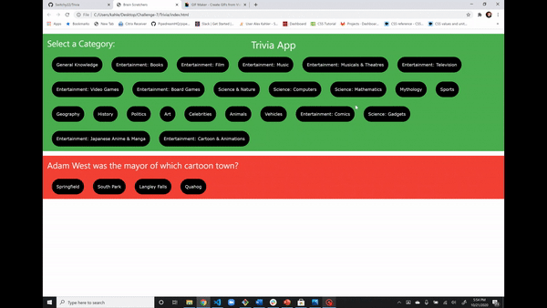

# Brain Scratchers

## Brain Scrathers is an interactive trivia game that pulls questions from a variety of categories to test the user's knowledge. The goal of this project was to create a simple and fun triva game. Each category generate 15 random questions that vary in difficulty from easy, medium and hard. At the end of the game users can then enter their name to record their highscore that is back up to their devices local storage. 

## Demo 

## Technology Used:

* HTML
* JavaScript
* CSS Framework - W3 Schools
* Trivia API - https://opentdb.com/api_config.php
* Gif API - https://developers.giphy.com/docs/sdk

#Links

## https://kahler197.github.io/Project-1/.

## https://github.com/Switchy22/Trivia.git

# The Team

### Calvin Johnson
### Samuel Bauer
### Zach Howell
### Alex Kahler